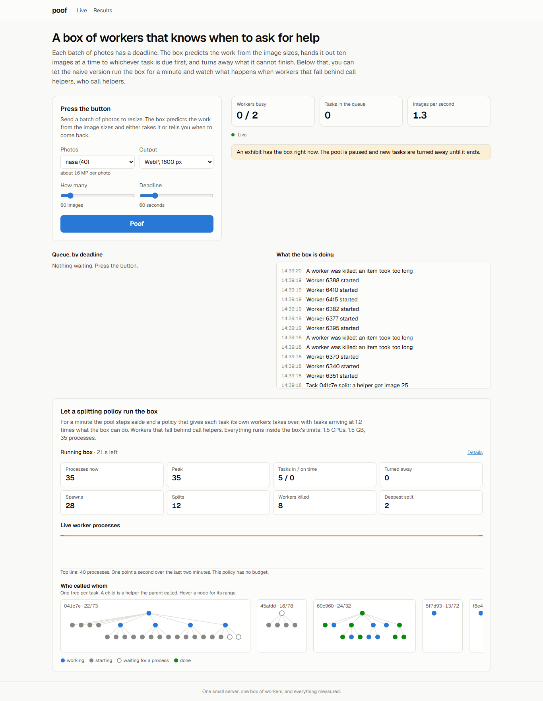
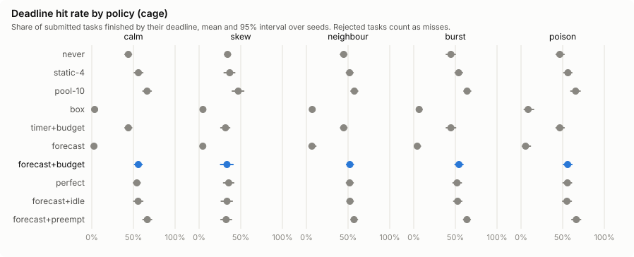
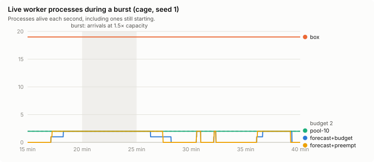
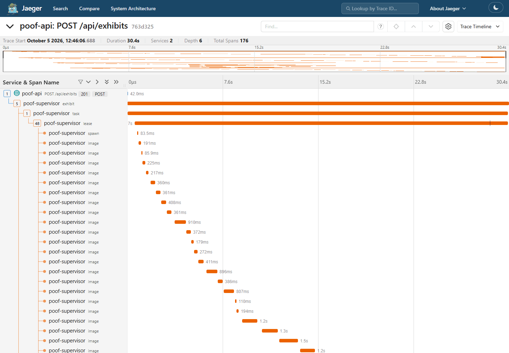

# poof

Inspired by the Meeseeks box from Rick and Morty: you press a button, a helper appears, does one job and disappears. If the job drags on, it panics and calls more helpers, who call more helpers, until the whole thing falls over. It isn't only a cartoon problem: an autoscaler that adds workers when a queue falls behind, or a client that retries when a call is slow, can do the same thing, because the extra load makes everything later and that brings more extra load. I wanted to build the engineering version of that and find out, with numbers, when calling for help actually helps.

poof resizes batches of photos against deadlines on one small server. You send a batch with a deadline, it predicts the work from the image sizes, and it either finishes in time or tells you up front that it can't. Next to it you can hand the box to the naive version for a minute and watch a worker that falls behind call helpers, who call helpers, inside a cage of 1.5 CPUs, 1.5 GB and 35 processes.

It's running at **[poof.najafov.dev](https://poof.najafov.dev)**. Press the button, or pick "The box" at the bottom and run it.



## The short version

I started out to build workers that split their remaining work when they fall behind, with a forecast to decide when and a budget to stop the storm. Before writing the service I simulated it, calibrated on benchmarks from the server it runs on. The forecast did beat a timer, and anything without a global budget fell over even at half load. But a plain pool that hands out ten images at a time, earliest deadline first, beat the best splitting policy by 5 to 24 points of deadlines met. The reason is preemption, not the forecast, so the box you press runs the pool, and the splitting policies are exhibits.

Then I ran the same exhibits in the real cage and replayed each one in the simulator. For the policies with a budget it agrees with reality run for run. Getting the storm right took three changes to the simulator, and the comparison turned up three bugs in the real system: a per-image timeout that killed heavy images as if they had hung, admission counting contention twice, and helpers that skipped their own warm-up.

## What I measured first

Everything in the simulator comes from benchmarks in `bench/`, run on the server in a container capped like the real cage.

- **One image is not linear in megapixels.** Resizing to 1600 px and saving WebP costs 81 ms below 1 MP and 520 ms at 40-70 MP, because JPEG decoding shrinks big images on load and the output size is capped. A power law fits much better than a line: `152 · MP^0.40` ms on the server.
- **Most of a worker's memory isn't its own.** A fresh worker shows 70 MB of RSS, but only 18 MB of it is private; the rest is shared libraries, mapped once for all of them. Private memory then grows over the first hundred images to about 140 MB and stays there. With `MALLOC_ARENA_MAX=2` that plateau is a third lower than with glibc's default, for about 4% of speed, so workers run with it.
- **A worker is 14 threads.** `pids_limit` counts threads, so the 256 I first planned for the cage would have allowed about 16 workers. It's 512.
- **Spawning a worker takes about 200 ms** (p95 330 ms) to the first image. IPC, a Redis claim and the split script are all under half a millisecond.
- **Past 1.5 cores, more workers only make it slower.** Two workers get 1.32 cores of useful work out of the cage. Thirty-five get 0.88, and every image takes 39 times as long as it would alone.
- **My laptop's numbers were useless for concurrency.** It has performance and efficiency cores, so single-process and multi-process runs landed on different core types and "effective cores" came out above the CPU limit. The contention curve comes from the server.

## What the simulator said

The simulator replays an hour of arrivals at a time: calm load, a skewed load where some batches hide a block of heavy images, a noisy neighbour taking half the CPU, a burst at 1.5 times capacity, and poisoned images plus a five-minute outage of one preset. Seventeen policies, three machine sizes, 20 seeds each, with the same arrivals for every policy so the comparisons are paired. 5,100 runs take about six minutes.

Deadlines met on the cage (1.5 CPU, budget of 2 workers); rejected tasks count as misses:

| policy | calm | skew | burst |
|---|---|---|---|
| never split | 44% | 34% | 45% |
| split on a timer, with a budget | 44% | 31% | 45% |
| split on a forecast, with a budget | 56% | 31% | 54% |
| forecast, plus preemption | 67% | 35% | 64% |
| **pool, 10 images at a time** | **66%** | **47%** | **64%** |
| the box (timer, no budget) | 17% | 11% | 14% |



What I take from this:

- **A forecast beats a timer.** A timer only notices a task is late once it already is. The forecast projects the finish from the measured rate and acts while there is still time: 12 points better on the cage in calm load, 21 to 34 on a bigger box. Estimating the rate isn't the hard part either; a forecast that knows the true cost of every image is within 2.5 points almost everywhere.
- **Without a global budget it all falls over, even at half load.** Splitting adds workers, workers add contention, contention makes everyone later, later workers split. On the cage the box sits at the process limit from the first minute, spends 36-40% of its CPU on spawns and killed work, and meets 17% of deadlines where never splitting at all meets 44%.
- **The pool wins, and the reason is preemption.** A pool that hands out small chunks earliest-deadline-first re-decides who gets a core every few seconds, which makes it preemptive EDF, the textbook optimum for deadlines on one machine. A worker that owns a task keeps its core until the task is done. Adding exactly that to the splitting policy (urgent work makes the latest-deadline worker yield at its next image) brings it level with the pool on the cage. It still loses on skew, where a heavy block needs every core at once, and it starts 1.3 to 4.6 processes per task, against 0.1 to 0.25 for the pool.
- **Granularity matters.** A pool with chunks of 100 drops back to the forecast's level.



The full numbers are in `packages/sim/results/server/summary.json`.

## What runs now

```
browser ──> Next.js ──> /api, /socket.io ──> NestJS API ──> Postgres
                                                 │   ▲
                                      POST /tasks│   │ Redis pub/sub
                                                 ▼   │
                                   supervisor (NestJS, one process, in the cage)
                                                 │
                                       worker processes (sharp), IPC only
```

**The supervisor is the only thing that changes scheduling state.** It keeps a working copy in memory and writes every transition to Postgres through one ordered queue; cursors are checkpointed every two seconds. Redis only carries the live view, so losing it costs a few seconds of dashboard. Outputs are written through a temp file and a rename, which makes redoing an image harmless, and that is what lets a restart simply resume from the checkpoints. There's a test that stops the supervisor halfway through a task and checks that no image is lost.

**Admission is a promise you can check.** A new batch is accepted only if the earliest-deadline-first schedule of everything already admitted still fits, with the work predicted from each image's dimensions and the cost model above, scaled by the CPU recent images have actually cost in this cage, against the CPU the workers get. The first version used a flat average per preset and turned away 45% of tasks in a calm hour, because a batch of small web images looked as expensive as camera photos. Refusals come back as 429 with a Retry-After from the projected drain time.

**Workers know nothing but IPC.** They get a range of images, report each one, and accept a `shrink` that cuts their range, which is how splits and preemption work: the worker answers whether the cut is past the image it is on, and only then does anything else move. The supervisor kills a worker that goes over its memory, misses three heartbeats, or spends ten times the predicted cost on an image (twenty on the second try, forty on the third), and it attributes the crash to the image that was in flight. An image that kills three workers goes to a dead letter queue, so one corrupt photo costs three restarts, not the batch. Workers raise their own `oom_score_adj`, so under memory pressure the kernel kills a worker and never the supervisor.

**Exhibits run the splitting policies on real processes.** The pool finishes its current chunks and steps aside, and the same policy code the simulator uses (`packages/core`) runs the box for a minute against a seeded stream of tasks. Visitors can run any policy, the box included, because the cage is what makes that safe: one exhibit at a time, at most a minute, a two-minute cooldown, three an hour per address.

**Every task is a trace.** With `OTEL_EXPORTER_OTLP_ENDPOINT` set, the API opens a span for the request and passes `traceparent` on, and the supervisor records the task, every chunk or lease, every spawn and every image. A helper's lease is a child of the lease that split, so a run of the box shows up in Jaeger as the same tree as the dashboard's "who called whom", with timings. In the trace below, the first lease's images go from 0.2 to 1.5 seconds as the box adds processes. The workers stay out of it. They know nothing but IPC, and an OpenTelemetry SDK in every worker would change the spawn cost the simulator is calibrated on, so the supervisor creates the image spans from what the worker reports. On a saturated pool the supervisor used 1.0-1.1% of the workers' CPU with export on and the same with it off. Jaeger runs as a compose profile with in-memory storage; it isn't on the public site.



## Simulator against reality

A simulator is only worth something if it predicts the real box, so I ran five policies in the real cage, three seeds each, a minute per run at 1.2 times capacity, and replayed every run in the simulator. Both sides see the same tasks: the exhibit and the replay draw their arrivals from the same seeded schedule (`exhibitSchedule` in `packages/core`), and the replay uses the measured cost of each image instead of the cost model. Averages over the three seeds, real against simulated:

| policy | on time | peak processes | spawns | workers killed for time | images done |
|---|---|---|---|---|---|
| pool | 36% / 31% | 2 / 2 | 0 / 0 | 0 / 0 | 162 / 196 |
| forecast, plus preemption | 32% / 36% | 2 / 2 | 8 / 8 | 0 / 0 | 160 / 179 |
| forecast, with a budget | 24% / 24% | 2 / 2 | 3 / 3 | 0 / 0 | 166 / 178 |
| forecast, no budget | 17% / 17% | 22 / 22 | 72 / 58 | 54 / 33 | 100 / 123 |
| the box | 17% / 17% | 24 / 18 | 79 / 42 | 58 / 17 | 94 / 136 |

**With a budget, it holds.** The number of tasks turned away matches in 14 of 15 runs, tasks met are within one in 14, and spawns are within one in every budgeted run. That's about as close as two real runs get: I ran the same seeds again an hour later, and one policy went from meeting 2 of 2 tasks to 0 of 2. Where it's off is throughput: the simulator finishes 7 to 21% more images than the cage does. I guessed the supervisor, which shares the cage's 1.5 CPUs, and measured it: 2-3%. So I sampled every process and thread in the cage while the pool ran (`bench/src/cage-sample.ts`). With the queue kept full, the real pool does 1.08 cores of useful work at 98% of its CPU quota, where the simulator assumes 1.32. Most of that is the calibration itself. Rerunning the benchmark the next day with minute-long windows instead of 15 seconds gave 1.24, and the allocator setting the real workers use costs about 4% more. The supervisor takes its 2-3%, and what's left is inside the benchmark's run-to-run noise. Writing the outputs costs nothing measurable.

**The same measurement found a bug in admission.** Admission corrected its predictions with the CPU time workers reported per image, measured while two workers shared the cage, and then divided by a capacity figure that already accounted for that sharing. On average the two errors cancelled, but the correction swung between 1.03 and 1.45 and flipped decisions. The same seed's 72-image task was accepted and finished on time three times, then turned away, and the queue sat empty for a quarter of the minute. Now work and capacity are both in CPU: each image's whole-process CPU against the CPU the workers actually get, weighted by work over the last couple of hundred images instead of one vote per image, and started from the measured ratio after a restart. In four warm runs of that seed, admission took the same tasks every time. That's too few runs to say it meets more deadlines; what I can say is that it stopped flipping.

**For the storm it took three fixes.** The first time I let the box loose in a copy of the cage on my machine, memory never ran out (941 MB at the peak); CPU did. Thirty-five workers on 1.5 cores made every image 20 to 40 times slower, the per-image timeout killed 133 workers in a minute, and each kill was a respawn. The first replay of the same run killed hundreds of workers for memory instead. I had charged each new worker its full 70 MB of RSS, and let it jump to its 140 MB plateau on the first image. With the private 18 MB at start and memory that grows with every image, the replay stopped running out of memory. Then the contention curve: I had measured up to five workers and guessed the rest, so I went back and measured 8, 12, 20 and 35. After that, the forecast without a budget storms in the replay much like the real one: the same peak, four fifths of the spawns, three fifths of the kills. The box still didn't: in the replay it split about half as often and topped out around 26-30 processes, while the real one sat at the 35-process cap with hundreds of spawns refused.

Those fixes changed the full results too. Before them the simulated box wasted 93% of its CPU and met 3-7% of deadlines; most of that drama was the memory model, not the box. The budgeted policies moved by less than a point.

**That gap was a bug in the real box, not in the simulator.** The rule is that nothing splits before a worker has done ten images of its own and two seconds have passed, so that one slow first image can't set off a split. The simulator followed it. The real engine handed every new helper its parent's image count, so a helper could split two seconds after it started, and in a storm, where each image is 40 times slower, two seconds is less than one image. In the recorded storms, 8 of 12 and 17 of 24 of the box's splits came from helpers, all of them with fewer than ten images of their own. After the fix, an e2e test that fails on the old engine and passes on the new one, the real box splits no more often than the replay (4 and 9 times in a minute, against 8 and 9), and its trees stay one level deep.

**The server isn't the same machine from day to day.** To check the fix I reran the storms and the contention benchmark on 5 October, only while other load on the host stayed under one core, with a script that waits for that and logs it every 15 seconds. A single worker, alone in the cage with nothing else changed, ran 27% slower than on 2 October, and every point of the contention curve came out 9-34% lower. That's bigger than everything I had been calibrating away. So I left the calibration as it was and gave the replay a speed probe: measure a single worker on the day of the real runs and scale the image costs by it. With that, the replay of the new storms matches the real ones in peak processes (30 in the cage and 33 in the replay for the box, 25 and 25 for the forecast) and spawns (72 and 72, 62 and 66), and finds three fifths to four fifths of the kills. It still counts 1.7 to 2.3 times the useful work the cage actually does in a storm. That's the part of the simulator I trust least.

**The simulator found a bug in the real timeout.** The per-image timeout was 10 times the prediction. Once the full simulation ran with it, the skew scenario started dead-lettering up to 48 healthy images an hour: the heavy blocks cost 5-10 times what their dimensions say, and with two workers sharing the cores they took 11-13 times the prediction, three times in a row. A timeout should tell a hung image from a heavy one, and a fixed multiple can't. Now the limit doubles on every retry. Skew's dead letters went to zero and the poison scenario didn't change, because poisoned images crash instead of hanging. The price is that a big image that really hangs costs 70 times its prediction before it's dead-lettered instead of 30; small images stay on the 5-second floor.

Before deploying that, I wrote down what the replay predicted for the same seeds: storm kills down 29% for the box and 18% for the forecast without a budget, no change for the budgeted policies. The real cage gave 29% and 39%, and no change. Right direction, one of the two sizes right.

Raw runs and replays are in `packages/sim/results/real/`.

## Things that went wrong on the way

- The synthetic image generator striped every image: a one-channel noise layer came back from `resize` with three channels and was read as one. Caught by looking at a crop, not by a test.
- On Windows, git doesn't record the executable bit, so the deploy script arrived on the server as a plain file.
- The server user is uid 1001 and the images run as 1000, so the supervisor couldn't write its own data folder until the containers ran as the host user.
- Every healthcheck is a `docker exec`. With six apps checking every five or ten seconds, dockerd was using most of a core; poof checks every 30 seconds in production.
- The API and supervisor images were 860-880 MB. `@prisma/client` declares the Prisma CLI and TypeScript as optional peers, pnpm satisfied them from the database package's dev dependencies, and a production install carried the CLI, Prisma Studio and a copy of PGlite. A small pnpm hook that drops those peers, plus deleting the query compilers for databases I don't use, took them to 430-460 MB. The migrate image had the pnpm store baked in; 1.39 GB down to 780 MB.
- Ending an exhibit of the box takes about 20 seconds, because the engine waits for its write queue, and a storm leaves hundreds of lease and worker rows in it. The pool stays paused for those seconds.

## Limits

- It's one machine. On several machines a helper on another box adds real capacity, and splitting might come out differently. I didn't build that.
- The 4-CPU results in the simulator are an extrapolation: the server has 4 vCPUs in total, so I only measured 1.5 and 2.
- The server's own speed changes by about a quarter from one day to the next, so the simulator's absolute throughput is only as good as the day it was calibrated on. Comparisons between policies run on the same curve and don't depend on it.
- In storms the simulator gets the processes and spawns right but counts up to twice the useful work the cage does.
- The per-preset circuit breaker is tested in the simulator and in e2e tests, but with two presets live it's more of a demonstration.
- There are no accounts. The only privileged thing is an admin token in the server's `.env`.

## Running it

Everything in Docker:

```bash
docker compose --profile app up -d --build
```

That starts Postgres (5447), Redis (6387), the supervisor (3110, with the cage limits), the API (3111) and the web app (http://localhost:3113). With `OTEL_EXPORTER_OTLP_ENDPOINT=http://jaeger:4318` in the environment and `--profile tracing` added, it also starts Jaeger, at http://localhost:3116. The supervisor needs photos in `data/poof/datasets`; to make them:

```bash
pnpm install && pnpm -r build
node bench/dist/make-synthetic.js --out data/synthetic --count 100
node bench/dist/fetch-nasa.js --out data/nasa --count 40
node apps/supervisor/dist/prepare-datasets.js --from synthetic=data/synthetic --from nasa=data/nasa --data data/poof
```

For development you need Node 24, pnpm 11 and Docker:

```bash
docker compose up -d                       # Postgres and Redis only
pnpm install && pnpm -r build
pnpm -r test                               # unit tests
pnpm --filter @poof/supervisor test:e2e    # real Postgres, Redis and worker processes
pnpm --filter @poof/api test:e2e
pnpm --filter @poof/sim sim --calibration server --policies all     # the 5,100 runs
pnpm --filter @poof/sim replay --runs results/real/runs-60s.json --manifest ../../data/synthetic/manifest.json --timeout-growth 1
```

`bench/run-linux.sh <label>` reruns the calibration benchmarks in a capped Linux container, and `docker/test.Dockerfile` runs the test suites on Linux, where the memory limit reads `/proc` and the heartbeat test can freeze a worker. `bench/src/exhibit-runs.ts` runs a series of exhibits through the API with the admin token. The unit and e2e suites also run in GitHub Actions on every push and pull request, against Postgres and Redis service containers (`.github/workflows/test.yml`).

## API

| | |
|---|---|
| `POST /api/tasks` | `{ dataset, preset, deadlineSeconds, count?, offset? }`: 201, or 429 with Retry-After |
| `GET /api/tasks`, `GET /api/tasks/:id` | tasks; one task with its leases, dead letters, decisions and trace id |
| `GET /api/tasks/:id/items/:n` | a finished image (kept for 24 hours) |
| `POST /api/exhibits` | `{ policy, durationSeconds, utilization?, dataset?, seed? }` |
| `GET /api/exhibits`, `/current`, `/:id` | past runs, the one running now, one run |
| `GET /api/datasets`, `/state`, `/health` | |
| `/socket.io` | `snapshot` every second and `events` in 150 ms batches |

## Where things are

| | |
|---|---|
| `packages/core` | the policies: pain, split sizing, EDF tokens with preemption, admission, breaker, cost model, timeouts, exhibit schedule |
| `packages/sim` | the simulator, its scenarios, results and charts, and the replay of real runs |
| `packages/worker` | the worker process and the handle that limits it |
| `packages/tracing` | OpenTelemetry setup, off unless an endpoint is set |
| `packages/db` | Prisma schema and migrations |
| `packages/imaging` | the presets |
| `apps/supervisor` | the scheduler, the lease engine for exhibits, datasets and the janitor |
| `apps/api`, `apps/web` | the public API and the dashboard |
| `bench` | the calibration benchmarks, the exhibit driver, the cage sampler and their results |
| `deploy` | the deploy script and the backup container |

## What's next

Find out where the storm's work goes that the simulator thinks gets done, take a speed probe before every real series instead of after, and then try worker pools on two machines, where splitting could still win.
